!!! warning

    Crosstab reports are generally less performant than standard table reports. This is a limitation of this type of
    report. Additionally, crosstab reports have other limitations that standard table reports do not have. However,
    they can still be a good choice when needing to organize and return your data in a specific way.

!!! info

    This article assumes there is already an existing report design created in BIRT Studio. If you need help creating
    a new report design, please refer to the [Getting Started](../introduction/getting-started.md) guide.

## Adding a Crosstab Report

1. Select **Insert** from the top file menu.
2. Hover over **Table** and select **Crosstab** from the dropdown menu.

A blank **Crosstab Builder** window will appear.

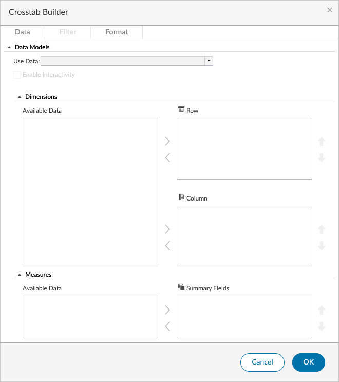

### Select the Data Source

From the _Use Data_ dropdown, find your data source and click on its _Data Model_. This can be any RDO currently in
your report design.

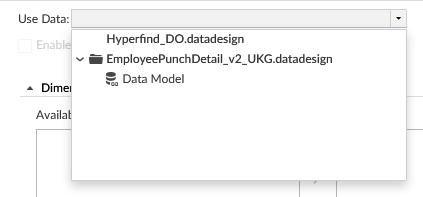

Once the _Data Model_ is selected, the _Available Data_ pane will populate with the _BaseDataSet_ folder. This can be
expanded and collapsed to show or hide the columns available in the data source.

### Adding Rows, Columns, and Summary Fields

Once you have selected the RDO to use in the crosstab table, it's time to start building it out by adding rows, columns,
and summary fields. These are what define a crosstab report.

!!! info "Clarification"

    All elements that are included in an RDO are called "columns". For the purposes of creating a crosstab report,
    we must make the distinction between RDO columns and crosstab "Columns". This is because the names are used
    somewhat interchangeably during the creation process. For clarity, lowercase _column_ refers to an RDO element
    and capitalized _Column_ refers to a crosstab Column.

#### Rows

RDO columns added as a Row will appear going across the table. Generally, the best columns to add as a Row are static
data, or data that does not change over time. However, this is a general rule of thumb and not necessarily always the
case. It will require some experimenting to determine what fits best for your use case. As an example of how rows will
appear with no other columns added, the following configuration produces the resulting output.

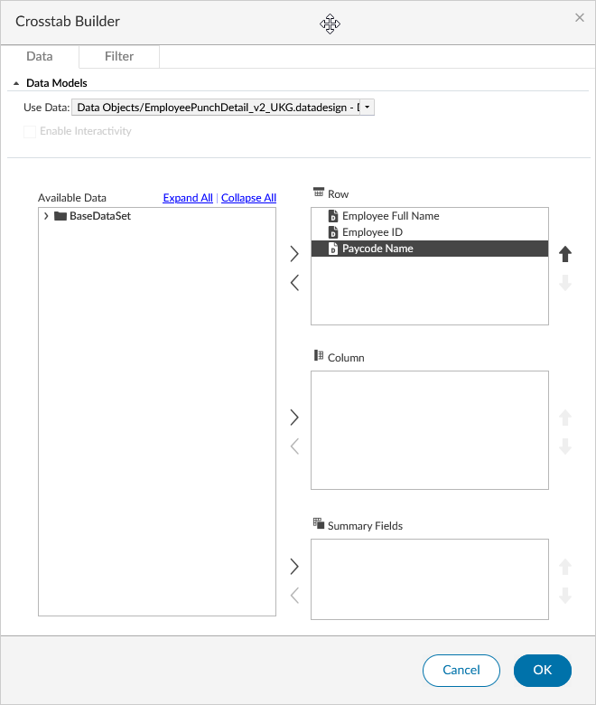

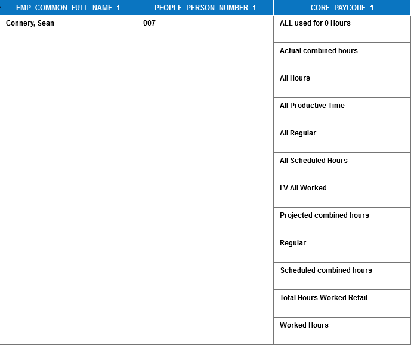

In this case, you can see the columns _Employee Full Name_ (EMP_COMMON_FULL_NAME_1) and _Employee ID_
(PEOPLE_PERSON_NUMBER_1) are displayed only once in the row, but the column _Paycode Name_ (CORE_PAYCODE_1) displays
one row for many Paycodes. This is because the employee listed earned all of those Paycodes in the specified time
period.

!!! info

    Your results may look different, and not all columns added as a Row will display the same as the _Paycode Name_
    column shown here. Crosstab Rows can also be distinguished by the empty cell directly above the column header
    when there is a Summary Field added.

!!! tip

    Column header names can be changed and cells formatted. This will be covered in a later section.

#### Columns

RDO columns added as a Column will appear going across the top of the table. They are placed _above_ the Row column
headers when a Summary Field is included. When there are no Summary Fields added, they will appear as column headers
similar to that of a Row field. It is unlikely that your crosstab report would have no Summary Fields, but it is worth
mentioning. Using the same 3 columns as the previous example, with _Paycode Name_ added as a Column, will look like
below.

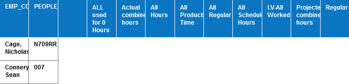

The Paycodes return one Column for each Paycode. Multiple Columns can be added by moving more columns over from the
left side. Subsequent columns will be added to the list and can be moved up and down in the hierarchy by clicking the
up and down arrows to reorder them. In this example, you can see that _Paycode Name_ is on top of the _Apply Date_
column.

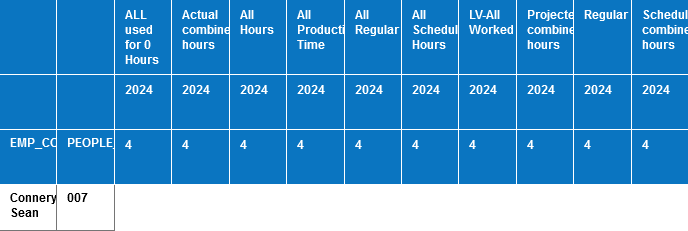

!!! info

    The _Apply Date_ column is a Date type column and by default is grouped by Year and Quarter. This screenshot was
    taken in the 4th quarter of 2024, so the _Apply Date_ column is displaying Q4 2024. This is default behavior of
    the crosstab report and can be changed by modifying the column properties. Modifying the Date Grouping will be
    covered in a later section.

!!! info

    Additional Columns will be displayed in the design as a new column header placed underneath the first one added.
    They will also appear this way in the report output as shown above.

#### Summary Fields

A Summary Field displays a value for each cell in the crosstab. This is the most important part of the crosstab
report, as it is what will display the data that you are looking for. Continuing with the same example, adding the
_Actual Hours_ (TIMECARD_TRANS_ACTUAL_HOURS_1) column as a Summary Field will produce the following output.

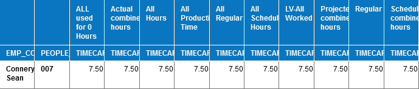

Multiple Summary Fields can be added and will be displayed underneath the Column(s), where the Column appears as a
merged column across the entire width of the Summary Fields. This is best illustrated with the image below, where
_Actual Wages_ (TIMECARD_TRANS_ACTUAL_WAGES_1) was added as a second Summary Field.

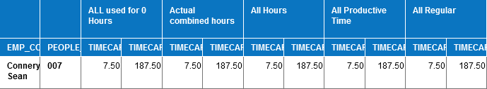

Summary Fields can be reordered by clicking the up and down arrows to the right of the field name. Rather than moving
the field up or down as with Columns, this reorders it from left to right within the Column.

The Summary Fields default to _Sum_. The full list of available functions is:

- _Sum_
- _Average_
- _Median_
- _Standard Deviation_
- _Variance_
- _Mode_
- _First_
- _Last_
- _Count_
- _Max_
- _Min_
- _Count Distinct_

Once you are satisfied with your choices, click **OK** to save the changes to the **Crosstab Builder** and generate
the crosstab table. After the table is generated, you can use the Analyze function to further customize the crosstab
report.

## Using the Analyze Function

To open the **Interactive Crosstabs** window:

1. Right-click on the crosstab table.
2. Select **Analyze** from the context menu.

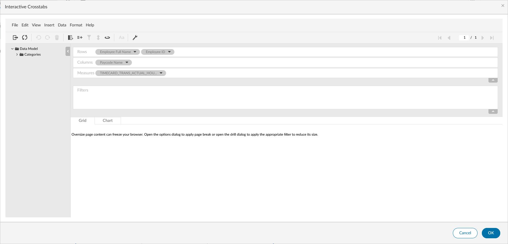

From this window, you are able to add columns as Rows, Columns, or Measures (Summary Fields), apply filters, generate
totals and subtotals across Measures, format column headers, and more.

### Formatting

To rename a column header from its RDO key name to something more readable:

1. Right-click on the column header cell.
2. Click **Change Text** and enter the new label.

The **Format** context menu options will vary depending on the cell selected. For example, selecting a data cell will
present options such as **Font**, **Format Data**, and **Conditional Formatting**.

!!! tip

    You can also select any cell and click the **Format** option from the file menu to explore available formatting
    options.

Cells and columns can be formatted in other ways as well, such as changing the width, setting the alignment, or
adding conditional formatting. These are all covered in the
[Editing and Formatting](../customizing-reports/editing-and-formatting.md#formatting-data) guide.

### Filtering

1. Drag a column to the _Filters_ area. A tooltip will display a green checkmark or red "X" indicating whether the
   column can be used as a filter.
2. In the **Filter** window that opens, select a condition. The same
   [filter conditions](../customizing-reports/filtering.md#filter-conditions) are available as in a standard report
   table.
3. Click **OK** to save the filter. It will appear in the _Filters_ area with the column name, condition, and value.
   Use the delete and edit icons to remove or modify filters.

### Computed Measures

1. From the file menu, select **Insert > New Computed Measure**. The **Computed Measure** window opens.
2. In the _Measure Label_ field, enter a label. This will also be the column header label.

    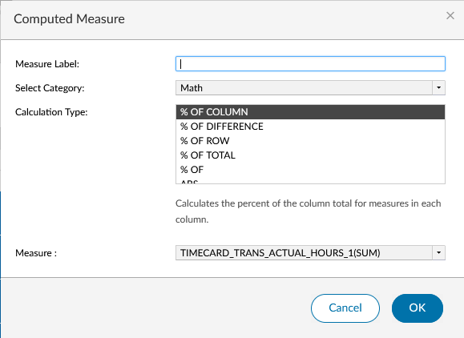

3. Select a category:
    - **Advanced...**: Allows the use of some BIRT functions to create a computed measure.
    - **Logical**: Provides an easy way to generate an IF statement as a computed measure with predefined values for
      the _Value True_ and _Value False_ fields. Custom values can also be entered manually by clearing the dropdown
      and typing your own.
    - **Math**: Provides many different calculations that can be performed on a measure to create a new measure based
      on an existing one.
    - **Relative Time Period**: Allows working with Date and DateTime fields as a "Time Dimension" to apply a limited
      set of functions (SUM, COUNT, AVERAGE, MIN, MAX) to a "Data Field".
4. Select a _Calculation Type_ from the available list. Configure the required values as prompted.
5. Click **OK** to save. The new computed measure will be added to the _Measures_ row at the top of the
   **Interactive Crosstabs** window.

!!! warning

    The Relative Time Period category does not work on a non-relative time period RDO.

!!! info

    The functions available for the **Advanced...** category are limited to only a few functions from the
    [function list](./computed-columns.md#birt-studio-functions). Generally they are limited to some logical
    functions such as `IF`, `AND`, and `OR`, and mathematical functions such as `MOD`, `ABS`, and others.

### Totals/Subtotals

1. While in the **Interactive Crosstabs** view, select **Data > Totals...** from the top menu. The **Totals** window
   opens.

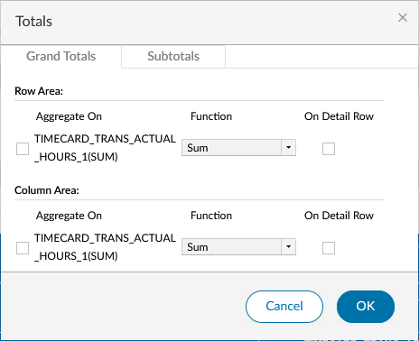

#### Grand Totals

The _Grand Totals_ tab configures totals for the entire crosstab. With a properly configured Crosstab, there will be
a _Row Area_ and a _Column Area_. For each Measure in the design, one item is generated in the _Aggregate On_ field.

1. In the _Grand Totals_ tab, check the box to the left of the Measure key you want to total.
2. Select a function from the dropdown list.
3. Optionally, check _On Detail Row_ to display the total on the detail row as well.

Selecting to total something in the Row Area will add a totals row at the bottom of the Crosstab that performs the
selected function on each column of data.

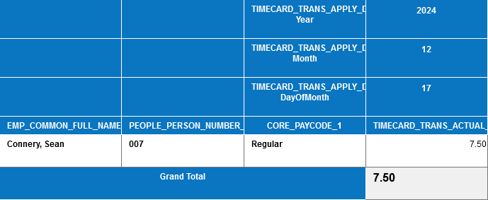

Selecting to total something in the Column Area will add a totals column at the end of the Crosstab that performs the
selected function on each row going horizontally across the report.

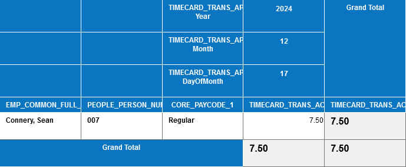

#### Subtotals

The _Subtotals_ tab lets you generate subtotals by row and column. This tab also contains a _Row Area_ and _Column
Area_. However, unlike Grand Totals, the number of items that appear is generated differently.

For the Row Area, this is based on the combinations of Measures and Rows. However, not all Rows are counted in the
generation. For example, with Rows _Employee Full Name_, _Employee ID_, and _Paycode Name_ with Measure _Actual Hours_, only
2 items are generated.

For the Column Area, this is based on the combinations of Measures and Columns.

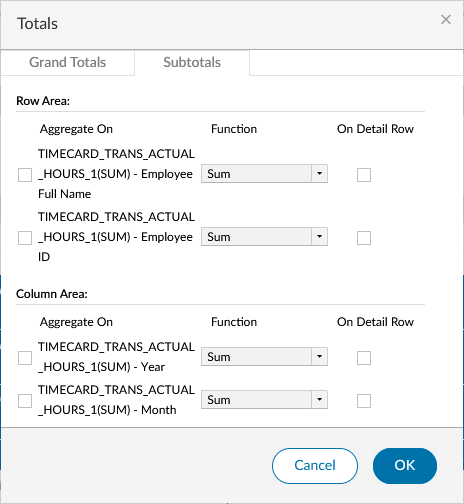

!!! info

    The total number of items displayed may vary from what is stated above depending on the other columns included
    in the Crosstab and designated as a Row. The examples provided used a limited set of columns from the RDO to
    keep the screenshots simple and the examples concise.

!!! warning

    Applying a subtotal to an item in either area will automatically check off the same subtotal item for the other
    Measure. For example, if you include _Actual Hours_ and _Actual Wages_ as Measures and _Employee Full Name_ and
    _Employee ID_ as Rows, checking off `TIMECARD_TRANS_ACTUAL_HOURS_1(SUM)` — _Employee Full Name_ will automatically
    check off `TIMECARD_TRANS_ACTUAL_WAGES_1(SUM)` — _Employee Full Name_ as well.

#### Row Area

Applying a Subtotal to an item in the Row area creates a new row within the existing Crosstab Row that extends the
width of itself up to the Row included in the subtotal item. This is best illustrated with the images below.

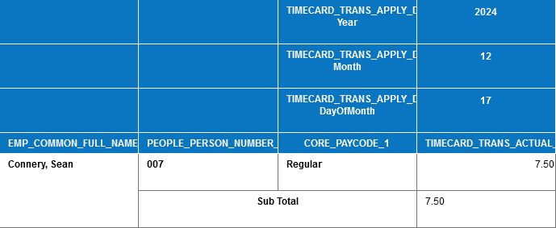

This shows that `TIMECARD_TRANS_ACTUAL_HOURS_1(SUM)` — Employee Full Name was checked in the **Totals** window. It
extends underneath the other Row items and up to the Employee Full Name Row item.

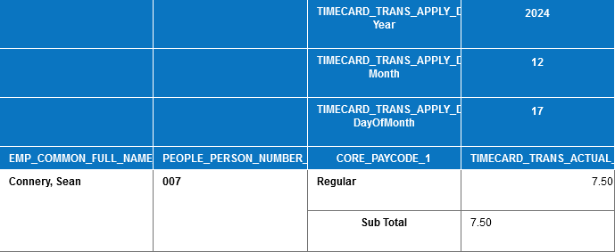

This shows that `TIMECARD_TRANS_ACTUAL_HOURS_1(SUM)` — Employee ID was checked in the **Totals** window. It extends
underneath the Paycode Name Row and does not go beyond the Employee ID Row item.

#### Column Area

Applying a Subtotal in the Column Area behaves the same way as in the Row Area — the _Sub Total_ column header will
extend up to the specified Column.

!!! info

    How a Subtotal behaves and is displayed in each area will depend on the Rows and Columns included. In the
    example here, we only had Employee ID and Employee Name as Rows. There are countless configurations that could
    be created, and applying a Subtotal will differ depending on your use case.

## Creating a Pivot Table

While in the **Interactive Crosstabs** viewer, select **View > Pivot** from the top menu. This swaps the current
Rows and Columns and can be useful if you want to see the data in a different orientation.

!!! info

    This is a toggle option. Selecting **View > Pivot** again will return the Rows and Columns to their original
    positions. Using this option is no different than if you added the Columns as Rows and the Rows as Columns in
    the **Crosstab Builder**.

## Setting Crosstab Options

1. Right-click the crosstab table and select **Analyze**.
2. From the **Interactive Crosstabs** window, click the **Options** icon.

### Measure Header Orientation

The _Measure Header Orientation_ option determines the direction that Measure headers are displayed. The default is
_Horizontal_, which places the Measure header as pictured in the screenshots in this article. Selecting _Vertical_
places a Measure header underneath the Column headers, one for each Row.

!!! tip

    Selecting _Vertical_ will most likely not be desired for most reports. However, feel free to experiment and see
    what works for you.

### Empty Rows and Columns

This option controls how empty Rows and Columns are displayed for the listed key. Checking either or both boxes will
show that empty Row or Column. To specify what BIRT outputs in the case of an empty cell, enter a value in the
_For empty cells, show_ field.

### Page Break

_Page Break_ allows you to set the row and column interval at which a page break will occur. The default values are
40 and 10, respectively. These can be modified, but could potentially cause clipping if set too large. The page will
break at whichever value is hit first. For example, if you run a report for 30 days for 1 employee and have a date
type Column, the Column Interval of 10 will be hit before the Row Interval of 30.

### Display Totals

This controls whether Grand Totals and Subtotals are displayed before or after the data. The default for both is
_After_. Changing this to _Before_ for Grand Totals will cause them to be displayed above the first Row. For
Subtotals, the subtotal row will be displayed above the data, but within the Row.

### Drill Size

This controls how far down you are able to expand grouped Rows while viewing the report in Interactive mode. The
default value is 2000 and is not recommended to be changed.

### Width

The _Width_ option changes how wide each cell is. The default value is 120 pixels, which will be acceptable for most
Crosstab reports.

## Getting Additional Help

If you have trouble while building your Crosstab report, please open a case with Support. They will be able to
assist you with any issues or questions.

!!! warning

    While in the **Interactive Crosstabs** window, there is a **Help** option. This will take you to the BIRT
    Studio documentation. This can be helpful if you are looking for more information on a specific feature or
    function. However, the documentation is not specific to the implementation of BIRT Studio within Pro WFM and
    may not be helpful in all cases.
