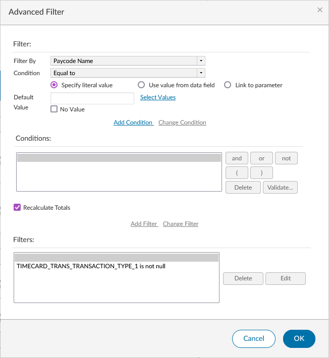
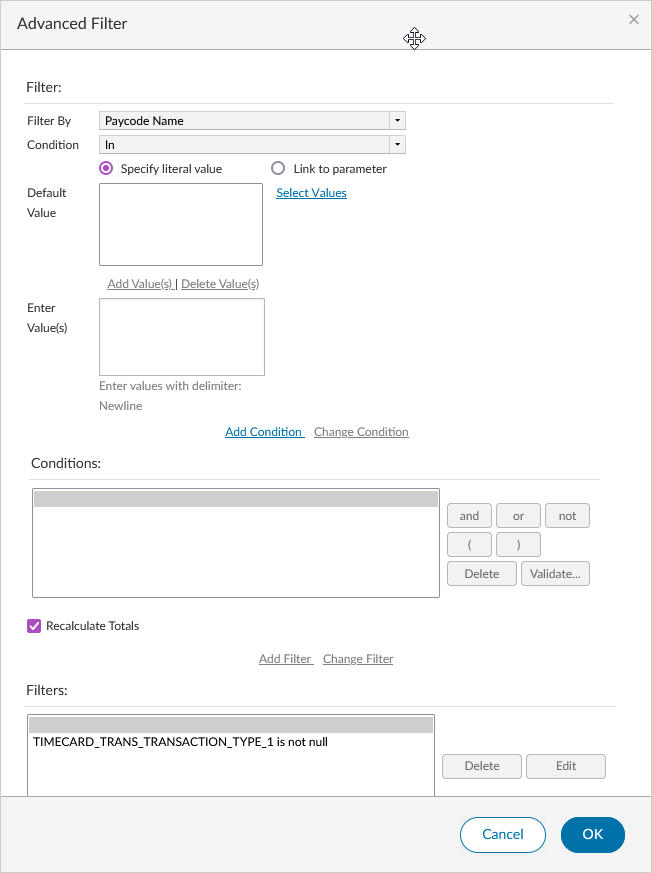
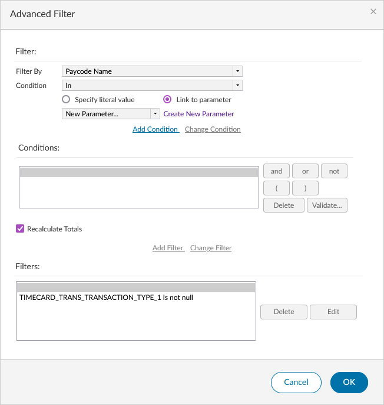
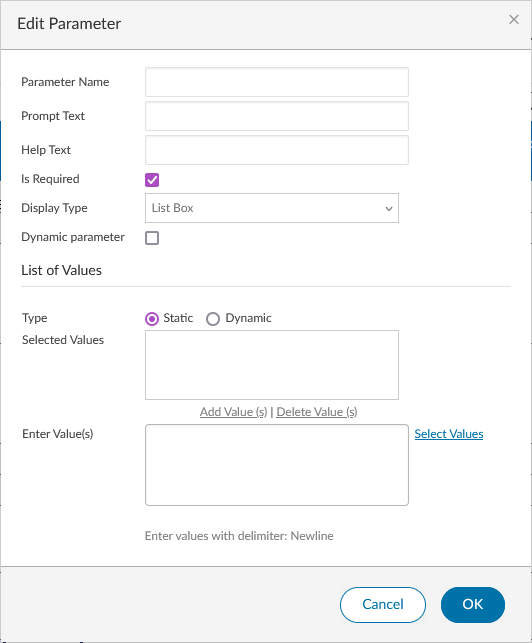
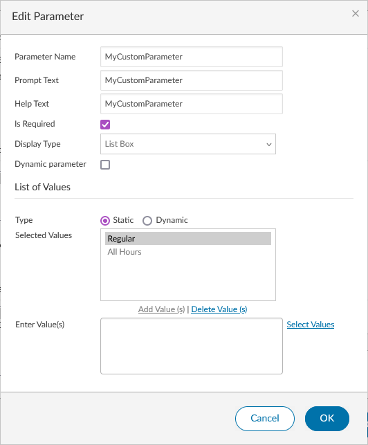
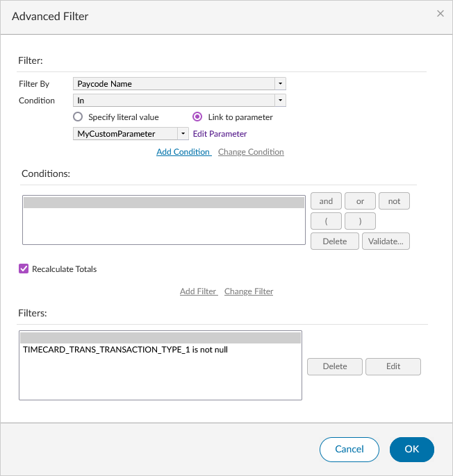
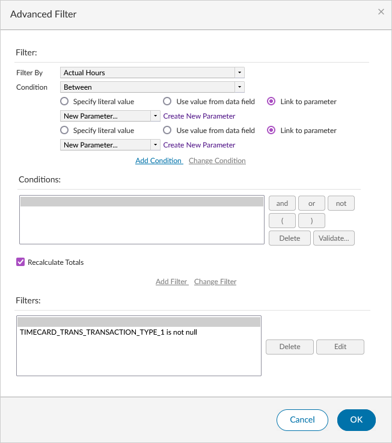
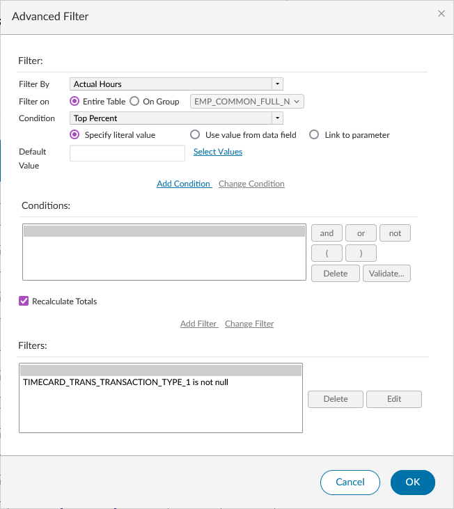

# Creating Custom Report Parameters

## What are Custom Report Parameters?

Custom report parameters are additional user-defined parameters that allow an end-user of the report to tailor that single run of the report. For example, in the _Condensed Employee Time Detail_ report, there is a parameter called _Pay Codes_. This parameter allows the user to select which pay codes they want to include in the report. A report designer can create this same _Pay Codes_ parameter in any report they design (assuming the report is designed in a way that supports this parameter).

A report parameter is simply a filter applied to a column with a specific condition as defined in [Filtering](../customizing-reports/filtering.md#filter-conditions). When the filter is applied and the report is saved, WFM and BIRT know how to take that parameter and convert it into an input for the user, such as a text box or select area (like with the _Condensed Employee Time Detail_ report).

!!! info

    Since there are so many different ways to create a custom report parameter, the steps in this article will be as
    complete as possible, without being a complete how-to for any one specific way.

## Creating the Parameter

### Selecting the Column

!!! note

    In the examples provided, we're using the Paycode Name column, but you can select whichever column you'd like
    from your own report.

!!! warning

    You cannot use Date or DateTime columns as parameters. This is because the built-in Timeframe parameter is a
    Date type parameter and adding another of this type or a similar type will cause conflicts or not work at all.

1. Open your report design.
2. Select the column you want to apply the parameter to.
3. Click the **Filter** icon.

If your filter window does not look like this, click the **Advanced Filter** link in the top right of the dialog that appears.

### Selecting the Condition

From the _Condition_ dropdown, select the condition you want.

!!! info

    Some columns work better than others with different conditions. Transactional data such as hours worked, wages
    earned, etc. are better suited for conditions that generate a text input such as "Greater Than", "Less Than",
    "Equal To", etc. Configurable data such as paycode names, employee names, employee IDs, pay rule names, and
    accrual code names are perfect candidates for using the _In_ condition, though other conditions will work for
    this type of data too.

!!! note

    Binary conditions such as _Is Not Null_ or _Is Null_ do not allow you to link to a parameter.

### Linking to the Parameter

1. Select the _Link to parameter_ radio button.
2. Click **Create New Parameter**. The **Edit Parameter** window opens.

!!! info

    Your window may look slightly different than this, depending on the condition you selected.

3. Fill in the parameter fields. The 5 inputs that are the same across all conditions are:

    -   _Parameter Name_ — The behind-the-scenes name used when the report is called. Keep the name in either `pascalCase` or `CamelCase`.
    -   _Prompt Text_ — A descriptive name for your Parameter. This changes how the label above the HTML input appears.
    -   _Help Text_ — This does not appear to be rendered. This can be set to the same as the Prompt Text.
    -   _Is Required_ — When unchecked, the parameter becomes optional. Leave checked to require the user to provide a value before running.
    -   _Display Type_ — Determines the type of HTML input that will be generated.
        -   _Text Box_: Creates a simple text input field that allows for manual text entry.
        -   _Text Box - Auto Suggest_: Creates a text input with auto-suggest functionality. Note: the auto-suggest functionality does not appear to work. Use _Text Box_ instead.
        -   _Combo Box_: Creates a dropdown that allows selection of a single item from a predetermined list (configured in the parameter).
        -   _List Box_: Selected with the _In_ and _Not In_ conditions. Creates a custom element that allows selecting multiple items at once.
        -   _Radio Button_: Creates a list of radio buttons that can be selected at runtime based on the values that are entered.
    -   _Default Value_ / _Enter Value(s)_ — Where you enter the filter value. _Default Value_ displays for all conditions except _In_ and _Not In_.

    !!! info

        The Display Type is generally selected automatically depending on the condition selected.

    !!! info

        Some Display Types appear to set their own Prompt Text that is not changed based on what is configured.

    !!! warning

        Using special characters in the Parameter Name is allowed but is not best practice. Stick to the suggestion
        provided and use `pascalCase` or `CamelCase`.

    !!! warning

        Dynamic parameters are not supported with the current implementation of BIRT Studio. Selecting any checkbox or
        radio button that changes the type from "Static" to "Dynamic" or makes the parameter a "Dynamic parameter" will
        not work.

4. If you are using the _In_ or _Not In_ conditions, click **Add Value(s)** to add your values before proceeding.
5. Click **OK** to save.

## Add the Parameter as a Filter

The **Advanced Filter** window should still be open. The dropdown that previously said **Create New Parameter** should now show the name of your Parameter.

1. Click **Add Condition**.
2. Click **Add Filter**.
3. Click **OK** to save all changes.

!!! warning

    A common mistake is forgetting to click **Add Filter** after clicking **Add Condition**. This will not save
    the filter as a parameter and will not complete the process.

## Viewing and Previewing the Results

Once the filter is saved, the report design will refresh and the **Save** icon will be visible (if previous changes were already saved).

1. Click the **Preview** button.
2. Specify the desired parameters.
3. Click **OK**.

The report will run in a new tab as if being run from the Report Library in Interactive mode.

## Deleting a Parameter

If you need to remove a custom parameter or want to start over:

1. Delete the filter:
    1. Click the **Filter** icon.
    2. Select the filter that corresponds to your Parameter.
    3. Click **Delete**, then click **OK**.
2. Delete the parameter:
    1. Navigate to **Data > Manage Parameters**.
    2. Find the Custom Parameter name and click the **Delete** icon.

!!! info

    You can perform these steps in either order, but if you delete the Parameter first and then go to delete the
    filter, you won't see the Parameter name anymore. Instead, you'll see a filter condition based on the condition
    you selected and the value(s) you entered. These get extracted and applied as a plain filter when the Parameter
    is deleted.

## Appendix A: Filter Conditions

Some of the filter conditions have additional configuration required or specific nuances that were not explained in the main article. The information provided in the headings below applies equally to the positive and negative version of each condition (e.g., Between vs. Not Between).

All [filter conditions](../customizing-reports/filtering.md#filter-conditions) are described in another article if you are unsure of how each one works.

### Between

Between requires setting two values instead of just one. This condition works best with numeric data such as hours or wages.

This condition uses a _Text Box_ Display Type by default. This can be changed to any other type except _List Box_. For example, to create a parameter that allows the user to specify a predefined amount, use _Combo Box_ or _Radio Button_. To allow the end-user to specify any value, use _Text Box_.

Link the same parameter twice to have the same values listed at runtime for the upper and lower bounds.

### Like

The _Like_ condition is used to filter data based on a pattern. This condition works best with text data, but could work with numerical data as well.

When creating a parameter using this condition, it is a good idea to only link it to a text-based piece of data such as pay code names or employee names. _Like_ is not typically used for numerical data.

### Match

The _Match_ condition filters data using a regular expression pattern. This is an advanced condition best suited for users familiar with regular expressions.

### Top Percent/n & Bottom Percent/n

The Top Percent/n and Bottom Percent/n conditions are only available with numerical data. When selecting one of these conditions, a new field called _Filter on_ appears, allowing the user to filter on the entire table or on a specified group.

This condition uses a _Text Box_ Display Type by default. This can be changed to any other type except _List Box_. For example, to create a parameter that allows the user to specify a predefined percentage, use _Combo Box_ or _Radio Button_. To allow the end-user to specify any value, use _Text Box_.

## Appendix B: Reserved Parameter Names

When you create a Parameter with a specific name, the application is designed to handle it a certain way. For example, creating a Paycode Parameter with the name `PaycodeType` exactly will create a Parameter that links to every single configured Paycode in the application. This includes both Regular and Combined Paycodes. The application will do this regardless of the values you enter into the _Enter value(s)_ field (when using the _In_ or _Not In_ condition). These are also called "Parameter Lists".

To view the full list of reserved Parameter names, click **Edit** on any Published Report, select a parameter, and click the **Edit** icon next to it. The **Edit Report Parameter** window will open with a table of reserved Parameter names and their corresponding "Parameter List".

-   `PaycodeType`
-   `PayCode`
-   `Exceptions`
-   `audittype`
-   `secrtyaudittype`
-   `peopleaudittype`
-   `att_events`
-   `att_combined_events`
-   `att_patterns`
-   `att_lost_time_events`
-   `att_actions`
-   `att_policies`
-   `att_other`
-   `ExceptionType`
-   `Paycodes`
-   `HourType`
-   `AbsenceType`
-   `Hours Summaries`
-   `supportusersecurityaudittype`

## Appendix C: FAQ

Since there are many ways to create a custom parameter, this section covers some common questions that were not addressed above.

### Why does my report preview only show one value when I added multiple?

If this is happening to you, you most likely selected the _In_ or _Not In_ condition when you [selected your condition](#selecting-the-condition).

In the **Edit Parameter** window, after adding your values and clicking **Add Value(s)**, only one value will be highlighted in the _Selected Values_ text area. This is the value that will appear when previewing the report. To see the other values, either <kbd>Ctrl</kbd>+<kbd>Click</kbd> the other values in _Selected Values_ to highlight multiple and then click **OK**, or run the report from the Report Library, which will return all correctly selected values at runtime.

### Why is my custom report parameter not appearing when I run my report from the Report Library?

This is a [known issue](../known-issues.md#custom-report-parameter-disappears-after-creation).
